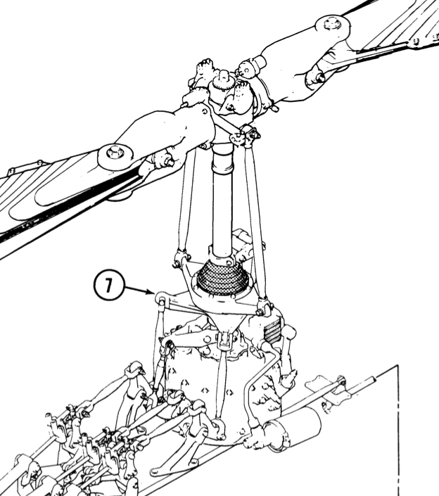

# Helicopter cyclic/collective controls, rigging and swash-plate

- [Demo video](https://youtu.be/AFvBazurowA)
- [Stud.io file](bell206-2022.03.07-pivot-sleeve.io)
- [Instructions](bell206-2022.03.07-instructions.pdf)

## Cyclic? Collective? How helicopters maneuver.
  
For a good introduction to how helicopters fly and the function of the
swashplate modeled here, I suggest [this video][heli-fly]. 

[heli-fly]: https://www.youtube.com/watch?v=2tdnqZgKa0E

In short, each blade of a helicopter rotor acts like a wing, generating lift as
it sweeps through the air, pulling up the aircraft.

By changing the pitch of all blades by the same amount we can change the
**amount** of thrust, moving the helicopter vertically. This is called the
**collective**.

By setting the pitch of each blade differently we can change the **direction**
of thrust, moving the helicopter horizontally. This is called the **cyclic**

> **NOTE: Gyroscopic Precession**
>
> The thrust on the rotor acts on the helicopter with a 90 degree lag. See [this
> video](https://www.youtube.com/watch?v=MH1emIx5Ubs) for an explanation.
> Therefore, the input from the cyclic stick has to be phase-shifted by 90
> degrees. More on this later.

There are two interesting problems here: 
1. How to adjust the pitch of the blades as they rotate through a full cycle,
   since the pitch of each blade under cyclic input has to depend on where it is
   in its rotation.
2. How to convert mechanical inputs of the cyclic and collective from the
   stationary cabin, where the pilot sits, to the rotating blades.

The **swashplate** solves these problems. Here is a
[video](https://www.youtube.com/watch?v=R2inFdHqXj4) of operation of a Bell 206
swashplate. 

# Model overview

| Bell 206 rigging | Model |
----------------------------
|  |  |

## Swashplate

- Diagram of swashplate from Bell 206 manual

- Corresponding part of model

## Rigging

While researching this topic I became fascinated not only by swashplate, but by
the mechanisms that convert a pilot's cyclic and collective inputs to swashplate
angles (the **rigging**), so I modeled that too.

- Overview diagram from manual

### Cyclic control

- Corresponding part of model

### Collective control

- Diagram of cyclic control from Bell 206 manual

- Corresponding part of model

### Mixing lever/bell crank

- Diagram of mixing lever from Bell 206 manual

Here is a [video](https://www.youtube.com/watch?v=cVNBC9EDOcU) of the Bell 206
mixing crank in operation. 

The design of the part is pretty deliberate, and it took me a lot of
experimentation to replicate the functionality.

- Corresponding part of model

> **Note:** The Bell 206 has a servo section between the mixing lever and the
> swashplate that I did not model. The servo section does not add anything
> educationally and increases clutter. In this respect the model is closer to
> the [Robinson R22](r22). I did not find detailed enough diagrams for the R22
> as I did for the Bell, so I modeled the Bell.

[r22]: https://en.wikipedia.org/wiki/Robinson_R22

> **Note:** The Bell 206 has a number of bell crank steps after the control
> tubes that emerge from the "broom closet" (the three vertical tubes rising
> from the mixing crank) and before the swashplate. I have not included these
> because they add clutter and don't add anything to the educational value of
> the model.

# Post-script: Helicopters in the computer age

There are current attempts to replace the mechanical swashplate with servo
motors on each blade that would electronically adjust the pitch of the blades.
This would reduce mechanical complexity (and insert new points of failure, IMO)
but I'm guessing this can make the helicopter lighter and perhaps more agile?

# References
- [Bell 206 maintenance
  manual](https://pscorp.ph/wp-content/uploads/2019/06/206-MO-S04-Flight-Controls.pdf)
- [Bell 206 mixing lever video](https://www.youtube.com/watch?v=cVNBC9EDOcU)
- [Robinson R22
  manual](https://robinsonheli.com/wp-content/uploads/2020/11/r22_mm_8.pdf)

# Appendix: Swashplate support design

We want the swashplate to tilt left-right and forward-backward, centered about
the point the rotor mast passes through it.

A swashplate supported only by the control and pitch links would slide about,
twist and tilt in undesirable directions. This is because the links need many
degrees of freedom and are insufficient to constrain the plate. (This is best
understood by building the physical model yourself.)

## Pivot Sleeve: Constraining swashplate motion I

All real helicopter designs that I studied use a specialized structure called a
pivot sleeve to solve this issue. The pivot sleeve constrains the swashplate to
move over part of a spherical surface, satisfying our requirement.

These are diagrams from the Bell 206 manual as an example.

- Diagrams

(I only recognized the importance of the pivot sleeve after building the first
iteration of the model. The plate was supported only by the control links and it
slid about everywhere.)

## Vertical guide: Constraining swashplate motion I

The spherical surface of the pivot sleeve is still not enough to completely
constrain the plate as we wish. The sleeve prevents the plate from sliding away,
but the plate can still twist, preventing proper

(In my -- what I thought was -- final design, I discovered the twisting problem.
I decided the issue could be solved by constraining the motion of one half of
the control links. This was kludgy and unsatisfactory. By happy accident I
discovered the vertical guide in the Bell 206 pivot sleeve and then noticed the
external vertical guide in the Bell 407 support.)

## Other LEGO models 

Steph77's helicopters (e.g. the [AW
169](https://rebrickable.com/mocs/MOC-12600/Ivan_M/aw-169-helicopter/#details))
use a [gear ball with grooves
(2907)](https://www.brickowl.com/catalog/lego-technic-gear-ball-with-grooves-2907)
to support the swashplate (created from
[2908](https://www.brickowl.com/catalog/lego-rotor-holder-2908) and
[2906](https://www.brickowl.com/catalog/lego-technic-rotor-4-blade-7-diameter-2906)).
This design puzzles me because the ball can not change vertical height on the
mast, so it prevents collective input, or, the ball is not always supported by
the plate.

The other motions are constrained by restricting the control 

I was unable to find a combination of LEGO parts to model such a specially
shaped sleeve to my staisfaction and had to settle for mimicking the function
with a gimbal instead. 

## Swashplate gimbal to mimic pivot sleeve

I created some initial designs with the gimbal mechanism at the center of the
swashplate, with the mast going through the center. I found these decently
clever, but decided they were making the swashplate very large and heavy.

These designs also required a duplication of the gimbal mechanism for both top
and bottom swashplates since I could no longer use the turntable part.

- Diagrams of earlier efforts

I finally arrived at a design that used the 

## The center of rotation should be the upper (rotating) plate

## Centers of rotation are important

It is important to have all the rod/link attachments happen at the plane/axis
of rotation.

1. The control rods that drive the swashplate need to attach on a plane that
   passes through the center of rotation
2. The scissor link should pivot at the point it touches the swashplate, and
   the axis of rotation has to go through the center of rotation of the pivot
   sleeve.

If these centers are not aligned, when the swashplate tilts off-axis links have
a lateral motion on top of rotational motion, and this causes links to seize up.

Even in the Bell 206, we can see that the protuberances (called horns) of the
lower swashplate bend upwards where the control rods are connected. i suspect
this is to bring the attachment points in the same plane as the center of
rotation of the pivot sleeve.

## Swashplate control rod constraints

The swashplate control rods need some degree of freedom, but not to much. If too
much is given, by using ball joints on either end, there is too much play and
the swashplate lolls about loosely. I solved this by strongly constraining the
lever side of the control rods - instead of ball joints, I use friction bushings
to restrict the sideways play of one end of the rods.

# Appendix: Learning experiences

## 90 degree phase shift of swashplate motion

Cyclic inputs are transferred to the swashplate with a 90 degree phase shift to
account for gyroscopic precession.

So, for American rotorcraft, like the Bell 206, whose blades turn
counter-clockwise, a forward motion on the stick needs to increase pitch on the
left blade (and decrease on the right), so that the thrust vector, after
gyroscopic precession, points forwards. (More pitch on left -> more thrust 90
degrees later, at the back).

I made the mistake of assuming that this meant that the _swashplate_ motion
_had_ to be 90 degree out of phase. I had seen a few educational videos where it
looked like the linkage directly moved the blade right above it.

I studied the Bell 206 manual until my eyes bled and I could not figure out
where the 90 degree shift was ocurring. It seemed that a forward motion of the
stick would result in a front back motion of the swashplate, with no phase shift
offered by the rigging. 

This stumped me for several days until, as I was in the middle of typing up a
question on aviation.stackexchange, staring at the Bell 206 manual, I suddenly
got it: The phase shift is done by the pitch links.

The pitch links are 90 degrees offset from the blade they control. This
mechanism is at the same time so simple, obvious and elegant that I
metaphorically banged my head on the table, especially since I had spent about
half an hour coming up with ad hoc mechanisms for shifting the phase for my LEGO
model, having decided to completely abandon the Bell 206 as a basis.

Thankfully, I figured it out before I went too far.

## Cyclic linkage

As we have discussed the control stick (1) moves the Y-bar (9) laterally and
longitudinally which in turn moves the cyclic part of the mixing bell crank.

My first model of this linkage used axles and axle joiners to mimic the Y-bar
frame. This was not rigid enough to drive the bell crank's lateral motion. 
I almost gave up, convinced that I would not be able to transmit lateral motion
from the stick to the crank and only longitudinal motion.

I started to investigate the MD 500 series, for which I also found a maintenance
manual, and whose controls use bellcranks to transform lateral stick motions
to longitudinal control rod motions to the mixing crank.

Fortunately, I went back and tried again, and replaced the axles with a lift
arm. The link arm is rigid enough to transmit the lateral motion properly. 

As an aside, I was stumped as to how the cyclic rigging allowed lateral motion,
[until a nice person on aviation stack exchange helped me
out][aviation-stack-1]. 

[aviation-stack-1]:
    https://aviation.stackexchange.com/questions/91631/how-does-this-bell-206-cyclic-control-linkage-work

The person explained that part 16 is a spherical bearing, which allows tube 15
to move laterally.

# Appendix: Other LEGO helicopter models with cyclic/collective

The aim of my model is educational: clearly expose all the linkages and levers
so that the principle of operation can be studied. The other models listed here
aim at creating a playable helicopter model with functioning controls, so the
mechanisms are completely or partially obscured.

- [Jonathan Warner's Swashplate and Gearbox
  model](https://www.eurobricks.com/forum/index.php?/profile/179518-jwarner/content/&type=forums_topic_post).
  [Video](https://www.youtube.com/watch?v=ZhGFicWf2TA). It looks the closest to
  my gimbal/cradle design: it pays attention to the center of rotation and how
  to constrain it without kludging things. It employs a very robust construction
  which, unfortunately, obscures the internals.
- [Fredrick Glockner's
  model](http://lego-technique.blogspot.com/2013/02/helicopter-rotor-with-cyclic-control.html).
  This is just the swashplate with no rigging. While the construction is very
  intricate and does a lot in a small space, the mechanism that constrains the
  swashplate is kludgy and relies on the give that the plastic parts have, to
  work. There does not seem to be affordance for the collective.
- [Lama Helicopter](https://www.youtube.com/watch?v=8U2VM3m6Ypc). It has working
  collective, cyclic and tail rotor controls beautifully compressed to scale,
  and it's been motorized. Some of the build is not regular LEGO. There is a
  wire connector for the cyclic and a modified piece in the rotor. The mechanism
  is hard to see.
- [Pattspatt's
  model](https://rebrickable.com/mocs/MOC-87154/Pattspatt/helicopter-42110-c-model/#details).
  This is an impressive helicopter built as an alternate build for the Land
  Rover set. It has the clearest diagrams for a LEGO helicopter control model I
  have seen.
- [Ivan_M's AH-77
  model](https://rebrickable.com/mocs/MOC-21317/Ivan_M/ah-77-hunter-helicopter/#details)
- [A wonderful KA-32 model from
  sheepo.es](https://www.sheepo.es/2014/10/kamov-ka-32-coaxial-helicopter.html#more).
  This is a coaxial helicopter, two rotors on top of each other, and the model
  shows how a swashplate works in this case, which is excellent. Again, the
  mechanism is hard to see.
- [Steph77's UH-1
  Huey](https://www.eurobricks.com/forum/index.php?/forums/topic/68431-mountain-rescue-uh-1-huey/)  
- [Steph77's AW
  169](https://rebrickable.com/mocs/MOC-12600/Ivan_M/aw-169-helicopter/#details).
  This uses a Technic gear ball to support the swashplate, but I don't see how
  the collective works in such a case, since the ball is fixed to the mast and
  can not change vertical position.
- [cyclic/collective rigging
  diagram](https://www.eurobricks.com/forum/index.php?/forums/topic/156205-moc-calypso-hughes-269b300-helicopter/&do=findComment&comment=2888754)
- [1](https://www.eurobricks.com/forum/index.php?/forums/topic/156205-moc-calypso-hughes-269b300-helicopter/)
  and
  [2](https://www.eurobricks.com/forum/index.php?/forums/topic/60459-effes-moc-corner/&page=24)
  Nice discussions on mixing levers on EuroBricks.

# Appendix: Personal notes

This was as much and more fun than I hoped for. I learned something about how
helicopters fly. I banged my head against interesting mechanical problems. I got
to work with my hands, and it was a fun puzzle to design everything with as few
parts and in as little space as possible.

I'm also a convert to the studless design of modern Technic. I was initially a
deep skeptic, but I really appreciate how the studless design makes lift arms
symmetric, and I really like the rounded ends of lift arms.

I'm still learning how to economically attach beams perpendicularly together,
but I'll get there.
